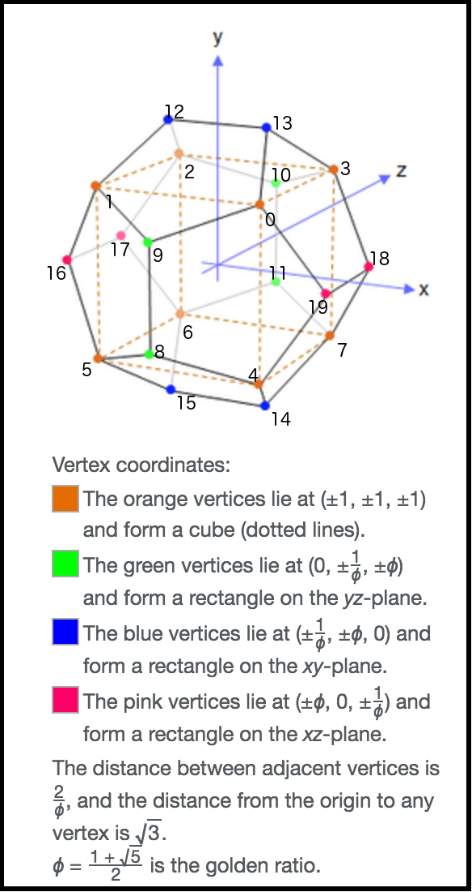

Experimental pyOpenGL code.  May use this in pymlac for the display.

Using instructions/code initially from
https://pythonprogramming.net/opengl-rotating-cube-example-pyopengl-tutorial/ .

Code from the link above:

* rotating_cube.py
* coloured_cube.py
* move_cube.py

Test drawing a dodecahedron:

* rotating_dodecahedron.py
* coloured_dodecahedron.py

Note, the dodecahedron vertex information is from [Wikipedia](https://en.wikipedia.org/wiki/Regular_dodecahedron):

test pymlac display with trace persistence:

* test.py

